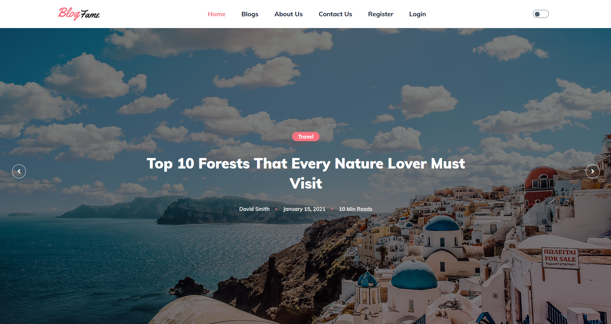
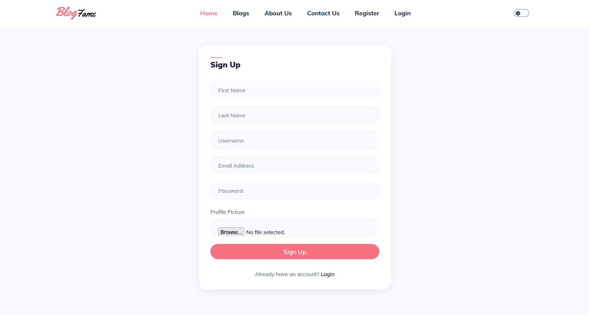
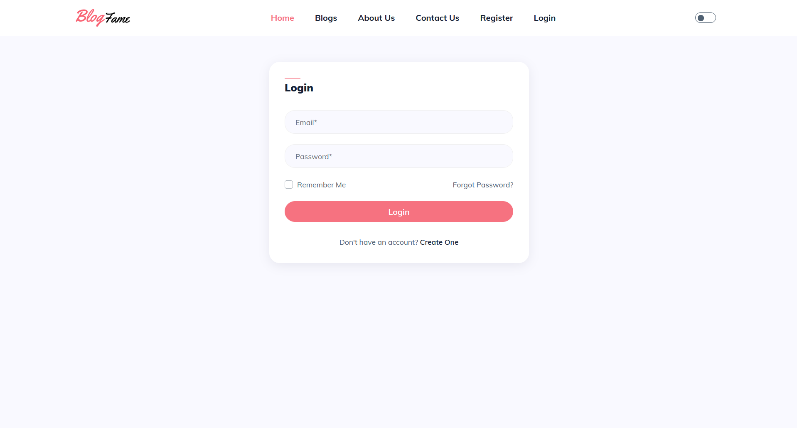
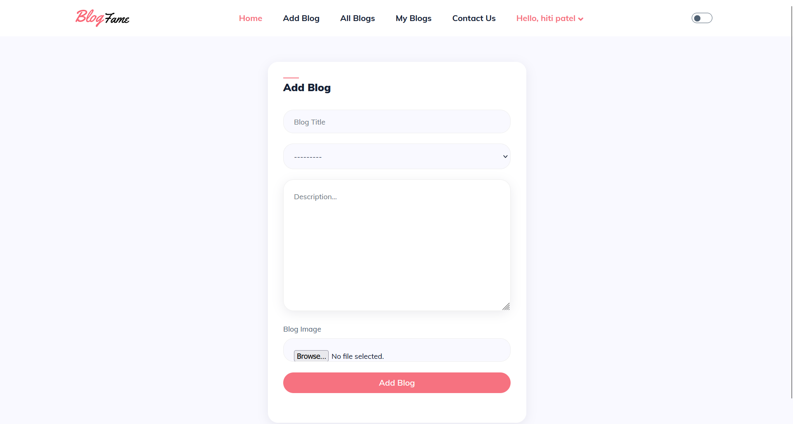
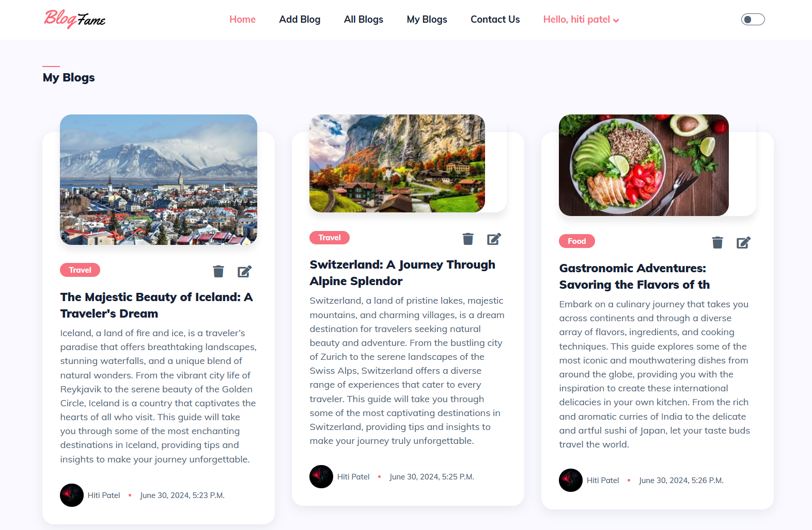
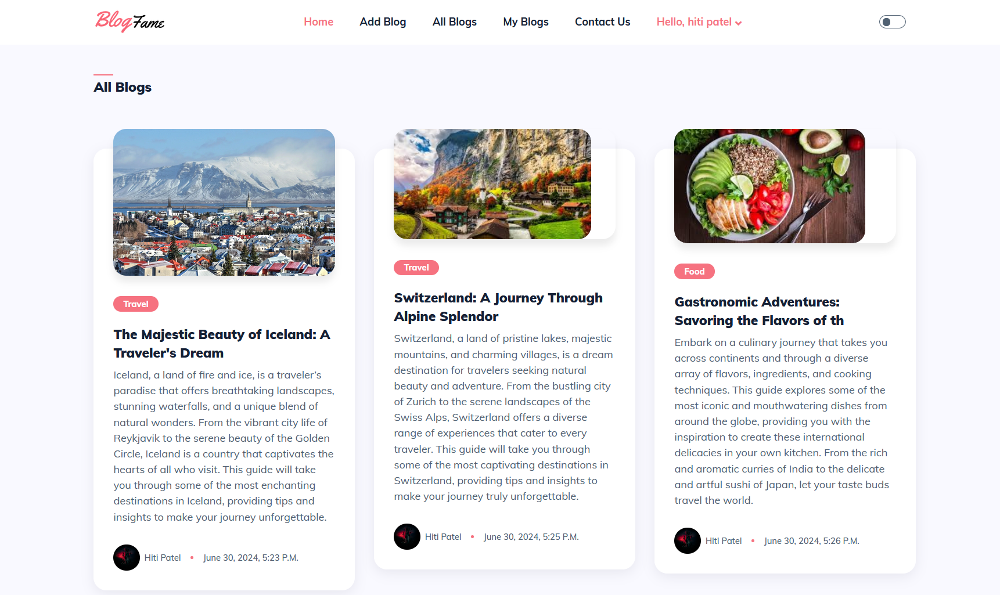

# Blogfame Project

## Overview
---

Blogfame is a Django-based blog website designed to provide a platform for users to create, share, and manage blog posts. It includes user authentication features, email confirmation for registration, and password management functionalities.

---

## Table of Contents :scroll:

- [Installation](#installation-arrow_down)
- [Getting Started](#getting-started-dart)
- [Usage](#usage-joystick)
- [Technologies Used](#technologies-used-woman_technologist)
- [Features](#features-star)
- [Project Structure](#project-structure-construction)
- [Images](#images-framed_picture)


---

# Installation :arrow_down:

### You will need to download Git to run this project

- [Git](https://git-scm.com/downloads)

#### Make sure you have the latest version of Git on your computer.

```
git --version
```

---
# Getting Started :dart:

### 1. Fork and Clone the repo

To Fork the repo click on the fork button at the top right of the page. Once the repo is forked open your terminal and perform the following commands

```
git clone https://github.com/<YOUR GITHUB USERNAME>/blogfame.git

cd blogfame
```

### 2. Install packages from the root directory

1. Create and activate a virtual environment:

   On macOS and Linux:
   ```bash
   python3 -m venv venv
   source venv/bin/activate
   ```

   On Windows:
   ```bash
   python -m venv venv
   .\venv\Scripts\activate
   ```

2. Install dependencies:

   ```bash
   pip install -r requirements.txt
   ```

   
### Running the Application

To start the web server locate to project root directory Blogfame:

```bash
python manage.py runserver
```

The application will run locally at `http://localhost:8000`.

---

# Usage :joystick:

Please create a new `.env` file from `.env.example` file.

Eg:

```env
DEBUG=False
EMAIL_BACKEND='django.core.mail.backends.smtp.EmailBackend'
EMAIL_HOST=''
EMAIL_USE_TLS=True
EMAIL_PORT=587
EMAIL_HOST_USER=''
DEFAULT_FROM_EMAIL=''
EMAIL_HOST_PASSWORD=''
```

---
# Technologies Used :woman_technologist:

- **Backend:** Python, Django
- **Frontend:** HTML, CSS, Bootstrap
- **Database:** SQLite3
- **Additional Features:** Email integration for user registration confirmation and password-related features.
---

# Features :star:

- User Registration and Authentication
- Create, Edit, and Delete Blog Posts
- Responsive Design with HTML, CSS and Bootstrap
- Email Confirmation for User Registration
- Password Reset Functionality
---

# Project Structure :construction:

The project structure follows Django's recommended layout, including separate apps for different functionalities (e.g., accounts, blog).

---

# Images :framed_picture:

- Home page


- Register page


- Login page


- Profile page


- Add Blog page


- My Blogs page


- All Blogs page


